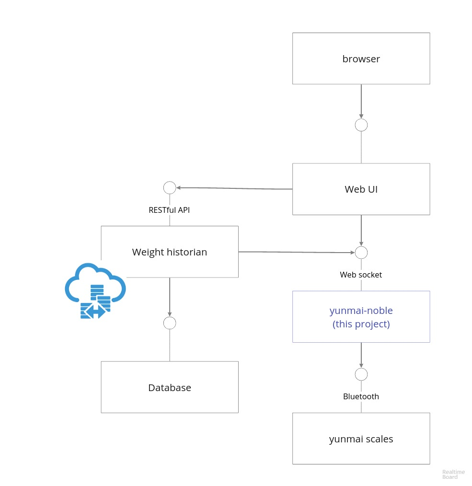

# yumnai-noble

Yunmai scales BLE node app in docker

## Idea



## Install on Raspberry Pi

1. Install docker
2. `docker run` the container
```
$ curl -fsSL https://raw.githubusercontent.com/Vanuan/yunmai-noble/master/run.sh | sh
```

## Development (on any laptop that supports BLE)
```
$ docker-compose up --build
...
yunmai_1  | Bluetooth poweredOn
yunmai_1  | Looking for peripheral...
yunmai_1  | Yunmai scales detected
yunmai_1  | Waiting for weighting...
yunmai_1  | Tue Oct 31 2017 10:07:22 GMT+0000 (UTC) 7.41 kg
yunmai_1  | Tue Oct 31 2017 10:07:22 GMT+0000 (UTC) 7.53 kg
yunmai_1  | Tue Oct 31 2017 10:07:23 GMT+0000 (UTC) 7.41 kg
yunmai_1  | Tue Oct 31 2017 10:07:23 GMT+0000 (UTC) 7.37 kg
yunmai_1  | Tue Oct 31 2017 10:07:23 GMT+0000 (UTC) 7.33 kg
yunmai_1  | Tue Oct 31 2017 10:07:23 GMT+0000 (UTC) 7.23 kg
yunmai_1  | Tue Oct 31 2017 10:07:23 GMT+0000 (UTC) 7.27 kg
yunmai_1  | Tue Oct 31 2017 10:07:24 GMT+0000 (UTC) 7.31 kg
yunmai_1  | Tue Oct 31 2017 10:07:24 GMT+0000 (UTC) 7.31 kg
```

